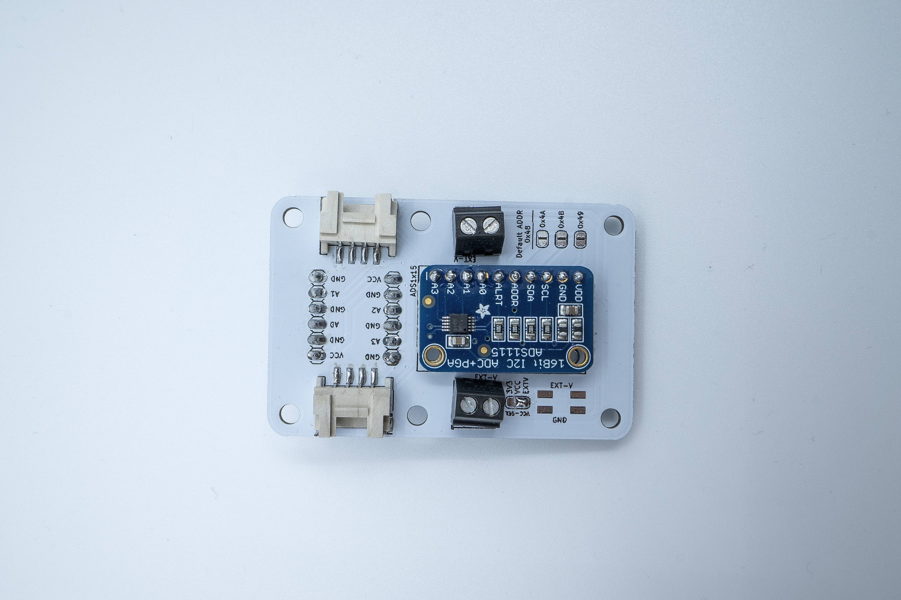

# SmartCitizen Analog Sensor Boards

This repository contains a set of boards that can interface the Smart Citizen Kit in different ways.

The SmartCitizen ASB is an expansion board for the [Smart Citizen Kit](https://github.com/fablabbcn/smartcitizen-kit-21) that provides connectivity to analog sensors with a high precission ADS1115 via I2C, with four configurable addresses. Daisy chainable up to 4 boards (or 2 in 8ch version) - with a total of 16 analog channels!

|Variant|# of Channels|External AREF needed|ADS format|
|:-:|:-:|:-:|:-:|
|4-channel|4|Y|SMD or [shield by adafruit](https://www.adafruit.com/product/1085)|
|8-channel|8|Y|SMD|
|8-channel-step|8|N|SMD|

## Characteristics

### Operating voltage

Natively operates at 3.3V, but can use also up to 5.5V in EXT-V, and with a selectable jumper. It integrates a level-shifter from the GROVE connector's voltage to EXT-V.

### Connectivity

I2C, from 3.3V up to 5.5V.